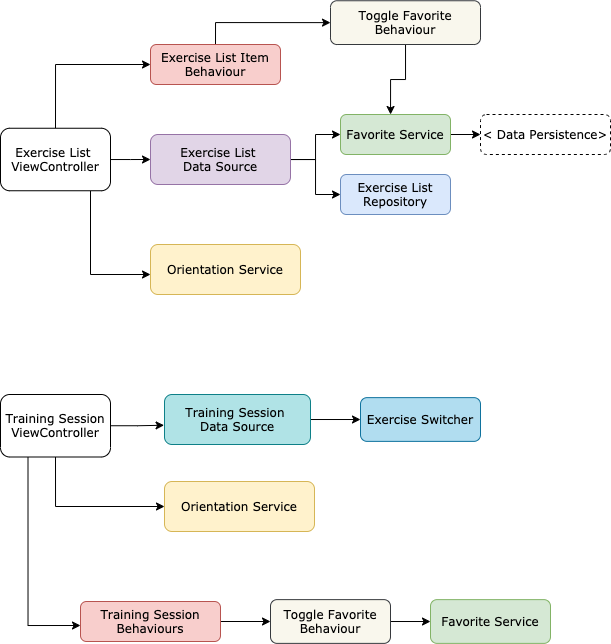

# Basic Exercise App Case Study


## Exercise list Feature Specs

### Story: User requests to see their exersice list

### Narrative #1

```
As an online user
I want the app to automatically load my exersice list
So I can know what is my next exercise set
```

#### Scenarios (Acceptance criteria)

```
Given the customer has connectivity
 When the customer requests to see their exercise list
 Then the app should display the latest exercise list from remote
 
 Given the customer has connectivity
 And the user already added some exercises to favorites
 When the customer requests to see their exercise list
 Then the app should display the latest exercise list from remote in addition to favorite state for each exercise.
```


### Story: User started training session

### Narrative #1

```
As an online user
When the user taps on `Start training` button
I want the app to start the training session 
And automaticlly switch to next exercise after 5 seconds
```

#### Scenarios (Acceptance criteria)

```
Given the customer has connectivity
 When the customer requests to see their exercise list
 Then the app should display the latest exercise list from remote
 
 Given the customer has connectivity
 When the customer tapped on start training button
 Then the app should display the exercise set image from remote in addition to favorite state for each exercise.
```

---

### Payload contract

```
GET

2xx RESPONSE

[
  {
    "id": 1,
    "name": "Exercise name",
    "cover_image_url": "https://image_url.png",
    "video_url": "https://video_url.mp4"
  },
  {
    "id": 2,
    "name": "Exercise name",
    "cover_image_url": "https://image_url.png",
    "video_url": "https://video_url.mp4"
  },
]
```

---

## App Architecture


